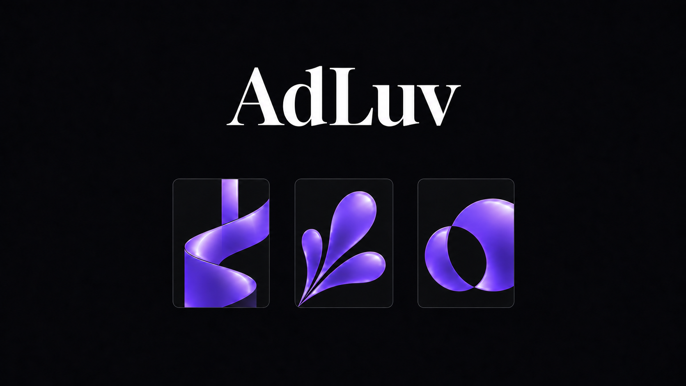
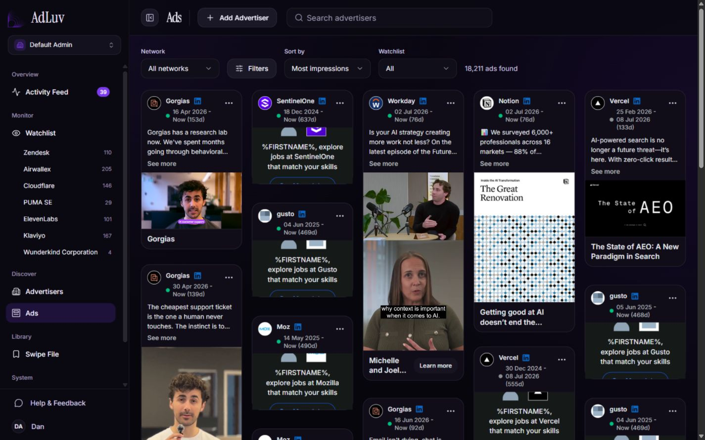
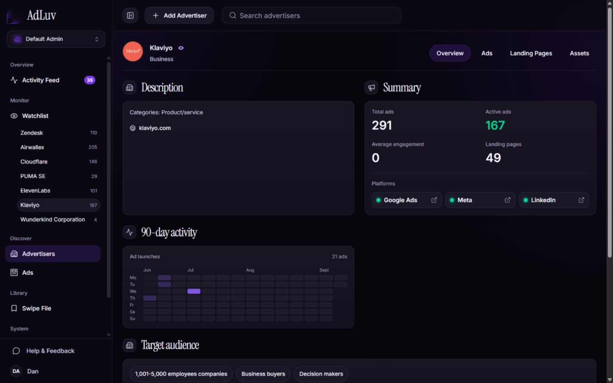
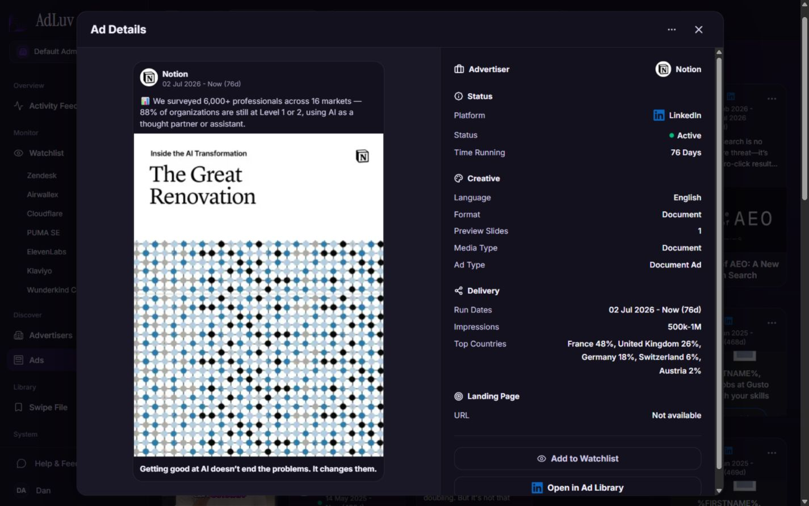

# AdLuv

[](https://adluv.co/)

[Website](https://adluv.co/)

Ad intelligence for discovering, tracking, and organizing ads across LinkedIn, Meta, and Google. AdLuv brings advertiser search, creative archives, saved collections, change alerts, landing-page captures, and MCP access into one TypeScript monorepo.

This repository contains the application source for running your own instance. Accounts are provisioned by an operator; public signup and checkout are not implemented. You supply the database, storage, and any external service accounts. Publishing this source does not include access to an existing hosted service or its ad archive.

## Screenshots

### Ad library

Browse ad creatives and filter by network, watchlist, or impressions.



### Advertiser overview

Review an advertiser's active ads, platforms, and launch activity.



### Ad details

Inspect a creative alongside its run dates, format, impressions, and delivery countries.



## What's included

| Workspace | Purpose |
| --- | --- |
| `apps/app` | Next.js product app, authentication, and API routes |
| `apps/site` | Next.js marketing site, blog, and Brevo waitlist |
| `apps/cms` | Next.js blog and media administration |
| `apps/worker` | MySQL job queue, scheduled syncing, media processing, and operator CLIs |
| `apps/cdn` | Local filesystem asset server |
| `apps/mcp` | Authenticated MCP server with stdio and HTTP transports |
| `apps/proxy-lab` | Network and source-adapter diagnostic runners |
| `packages/auth`, `packages/db` | Authentication helpers, Drizzle schema, and database access |
| `packages/config`, `packages/source-adapters`, `packages/ui` | Shared configuration, ad-source integrations, and UI |

The main stack is Next.js, React, Tailwind CSS, Better Auth, Drizzle, and MySQL. Background jobs live in MySQL; Redis is not required.

## Run locally

Use **Node.js 24 LTS**, **Yarn 4.13.0**, and a reachable **MySQL 8** database. The repository does not start MySQL for you. See [Development](docs/Development.md) for database creation and optional services.

```sh
git clone https://github.com/suciudan/adluv.git
cd adluv
corepack enable
yarn install --immutable
cp .env.example .env.local
```

Edit `.env.local`: set `DATABASE_URL` to your development database, generate a unique `BETTER_AUTH_SECRET`, and keep the app/auth/public origins consistent. Set `CDN_STORAGE_ROOT` to the absolute path of `apps/cdn/storage` in your checkout. For example, generate a secret with `openssl rand -hex 32`.

```sh
yarn db:push
yarn db:verify
yarn auth:provision-user -- --email "owner@example.com" --username "owner" --name "Local Owner" --role owner
yarn app
```

The provisioning command prompts for a password. Open [the local app](http://127.0.0.1:3001) and sign in with that username and password. `yarn app` also starts the local asset server on port 3101. Start `yarn worker` in another terminal when you need background jobs.

Use `db:push` only for this empty-database setup. The historical `db:migrate` chain is incomplete for fresh installs. Read [Database workflow](docs/database-workflow.md) before changing an existing database.

The initial database has no collected ad archive. Live ad retrieval needs source access and may require WebScrapingAPI or your own proxy configuration. Email alerts need Resend. The marketing site requires Brevo configuration at startup, so start it separately with `yarn site` after configuring its waitlist. See the [integration requirements](docs/Development.md#integrations).

## Common commands

| Command | Action |
| --- | --- |
| `yarn app` / `yarn worker` | Product app + asset server / background worker |
| `yarn site` / `yarn cms` | Marketing site on 3000 / CMS on 3002 |
| `yarn mcp:serve` | HTTP MCP service on 3010 |
| `yarn test` | Workspace unit suites; some workspaces have no test suite |
| `yarn typecheck` / `yarn lint` | Workspace static checks |
| `yarn build` | Production builds; needs configured build environment |
| `yarn test:e2e` | Playwright suite using a disposable MySQL database |

`yarn dev` starts every workspace development process, including optional surfaces. Start only the services you need while configuring a new installation.

## Documentation

- [Development and integrations](docs/Development.md)
- [Deployment](docs/Deployment.md)
- [Preparing a release](docs/Releasing.md)
- [Account provisioning](docs/private-beta-account-provisioning.md)
- [Database workflow](docs/database-workflow.md)
- [Blog MDX components](docs/blog-mdx-components-reference.md)
- [Proxy lab](apps/proxy-lab/README.md)
- [Contributing](CONTRIBUTING.md) and [security reporting](SECURITY.md)
- [Dependency audit and remaining toolchain advisory](docs/DependencyAudit.md)

## License and data

AdLuv source is available under the [MIT license](LICENSE). Bundled OCR models and installed dependencies retain their own licenses; see [Third-party notices](THIRD_PARTY_NOTICES.md).

External ad libraries, creatives, logos, and landing pages remain subject to their owners' rights and service terms. Source adapters depend on external endpoints that can change or restrict access. Review provider terms before collecting, storing, or redistributing their content.
